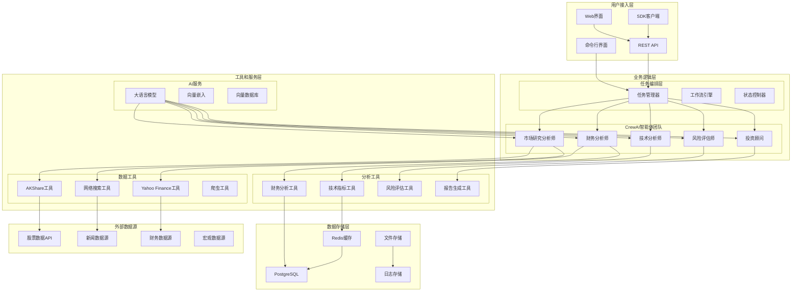
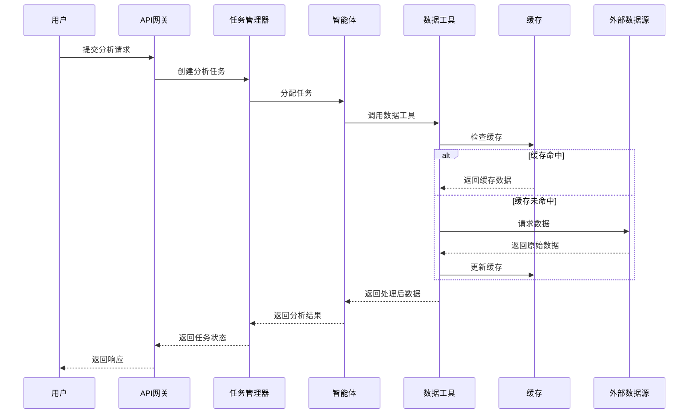
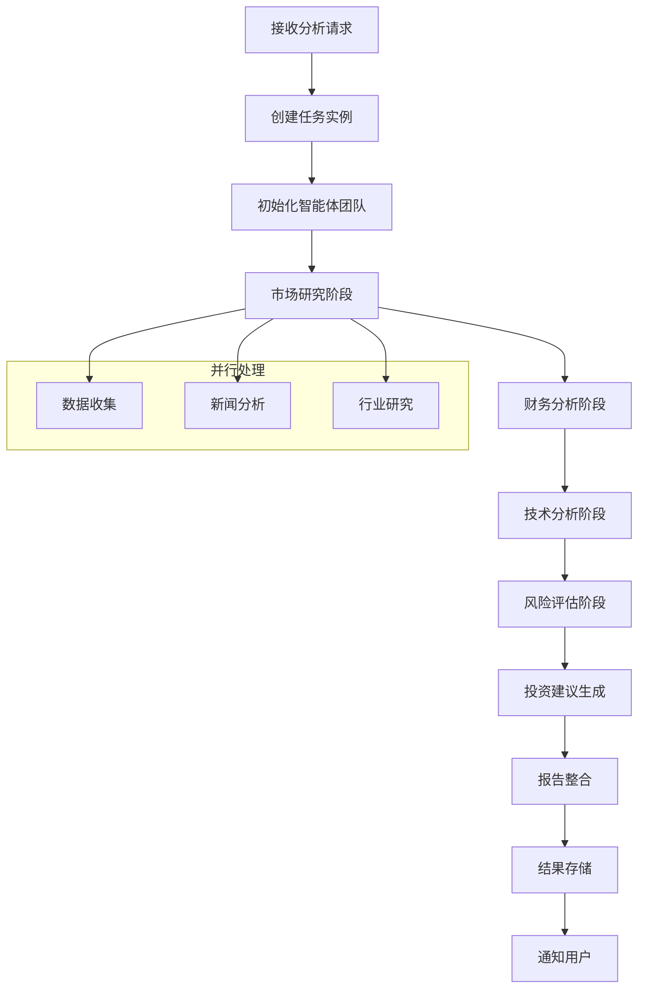

# 系统架构

CrewAI股票分析系统采用多智能体协作架构，结合现代化的技术栈，为用户提供专业的股票投资分析服务。

## 目录

- [整体架构设计](./整体架构设计.md) - 系统整体架构和设计理念
- [技术栈选择](./技术栈选择.md) - 核心技术和框架选择
- [模块设计](./模块设计.md) - 详细的模块划分和职责
- [数据流设计](./数据流设计.md) - 数据处理和流转机制
- [安全设计](./安全设计.md) - 系统安全和权限控制

## 架构概览

### 系统定位

CrewAI股票分析系统是一个**智能化、模块化、可扩展**的投资分析平台，主要特点：

- 🤖 **多智能体协作** - 模拟专业投资团队的分工协作
- 📊 **全面分析维度** - 覆盖基本面、技术面、风险等多个角度
- 🔄 **实时数据处理** - 支持实时数据获取和分析
- 🛠️ **高度可配置** - 支持灵活的参数调整和功能定制
- 🌐 **多种访问方式** - 支持CLI、API、Web等多种使用方式

### 设计原则

#### 🎯 架构原则
1. **单一职责** - 每个组件只负责特定的功能
2. **松耦合** - 组件间通过接口交互，降低依赖
3. **高内聚** - 相关功能聚集在同一模块内
4. **可扩展** - 支持新增智能体和工具
5. **可测试** - 组件可独立测试和验证

#### 🔧 技术原则
1. **配置驱动** - 通过配置文件控制系统行为
2. **异步优先** - 使用异步处理提升性能
3. **错误隔离** - 单个组件失败不影响整体系统
4. **监控友好** - 内置日志和监控机制
5. **云原生** - 支持容器化和微服务部署

## 整体架构图



## 核心架构组件

### 1. 智能体协作层 (Agent Layer)

#### 智能体设计
每个智能体都具有：
- **明确的角色定义** - 专业身份和职责范围
- **具体的目标设定** - 要达成的分析目标
- **丰富的背景故事** - 提供行为动机和专业背景
- **专用的工具集** - 针对角色优化的工具组合

```python
# 智能体架构示例
class StockAnalysisAgent:
    def __init__(self, role: str, goal: str, backstory: str, tools: List[Tool]):
        self.role = role
        self.goal = goal
        self.backstory = backstory
        self.tools = tools
        self.memory = AgentMemory()
        self.executor = AgentExecutor()

    async def execute_task(self, task: Task) -> TaskResult:
        # 任务执行逻辑
        pass
```

#### 智能体通信机制
- **消息传递** - 智能体间通过结构化消息通信
- **共享状态** - 通过共享状态存储交换信息
- **事件驱动** - 基于事件的异步通信模式

### 2. 任务编排层 (Task Orchestration Layer)

#### 任务管理器
```python
class TaskManager:
    def __init__(self):
        self.task_queue = TaskQueue()
        self.executor_pool = ExecutorPool()
        self.state_manager = StateManager()

    async def submit_analysis(self, request: AnalysisRequest) -> str:
        """提交分析任务"""
        task_id = self.generate_task_id()
        workflow = self.create_workflow(request)
        await self.task_queue.enqueue(task_id, workflow)
        return task_id

    async def get_task_status(self, task_id: str) -> TaskStatus:
        """获取任务状态"""
        return await self.state_manager.get_status(task_id)
```

#### 工作流引擎
- **顺序执行** - 按预定义顺序执行任务
- **并行处理** - 支持独立任务并行执行
- **条件分支** - 根据中间结果调整执行路径
- **错误恢复** - 任务失败时的重试和恢复机制

### 3. 工具服务层 (Tool Service Layer)

#### 数据获取工具
```python
class DataAcquisitionTool:
    async def get_stock_data(self, ticker: str, period: str) -> StockData:
        """获取股票价格数据"""
        pass

    async def get_financial_data(self, ticker: str) -> FinancialData:
        """获取财务数据"""
        pass

    async def get_news_data(self, company: str) -> List[NewsItem]:
        """获取新闻数据"""
        pass
```

#### 分析计算工具
```python
class AnalysisCalculationTool:
    def calculate_technical_indicators(self, price_data: StockData) -> TechnicalIndicators:
        """计算技术指标"""
        pass

    def calculate_financial_ratios(self, financial_data: FinancialData) -> FinancialRatios:
        """计算财务比率"""
        pass

    def assess_risk_metrics(self, data: Dict) -> RiskMetrics:
        """评估风险指标"""
        pass
```

### 4. 数据存储层 (Data Storage Layer)

#### 存储架构
```python
class StorageArchitecture:
    def __init__(self):
        self.cache = RedisCache()          # 热数据缓存
        self.database = PostgreSQLDB()     # 结构化数据存储
        self.file_storage = FileStorage()  # 报告文件存储
        self.vector_db = VectorDatabase()  # 向量数据存储

    async def store_analysis_result(self, result: AnalysisResult):
        """存储分析结果"""
        # 缓存关键指标
        await self.cache.set(f"metrics:{result.ticker}", result.key_metrics)

        # 存储完整数据
        await self.database.insert("analysis_results", result.to_dict())

        # 保存报告文件
        await self.file_storage.save(f"reports/{result.task_id}.md", result.report)
```

## 数据流架构

### 数据获取流程


### 分析处理流程


## 扩展性设计

### 智能体扩展
```python
# 新增智能体的接口
class CustomAgent(BaseAgent):
    def __init__(self, config: AgentConfig):
        super().__init__(config)
        self.custom_tools = self.load_custom_tools()

    async def execute_custom_analysis(self, data: Any) -> Any:
        """实现自定义分析逻辑"""
        pass

# 注册新智能体
agent_registry.register("custom_sentiment_analyst", CustomAgent)
```

### 工具扩展
```python
# 新增工具的接口
class CustomDataTool(BaseTool):
    name: str = "Custom Data Tool"
    description: str = "自定义数据获取工具"

    async def _arun(self, query: str) -> str:
        """异步执行工具"""
        return await self.fetch_custom_data(query)

    def _run(self, query: str) -> str:
        """同步执行工具"""
        return self.fetch_custom_data_sync(query)
```

## 性能优化策略

### 1. 缓存策略
- **多层缓存** - L1内存缓存 + L2Redis缓存 + L3数据库缓存
- **智能过期** - 基于数据类型和访问模式的过期策略
- **预热机制** - 常用数据预加载

### 2. 并发处理
- **异步执行** - 基于asyncio的异步处理
- **任务池** - 限制并发数量防止资源耗尽
- **负载均衡** - 任务分发到多个执行器

### 3. 资源管理
```python
class ResourceManager:
    def __init__(self):
        self.connection_pool = ConnectionPool(max_connections=100)
        self.rate_limiter = RateLimiter(requests_per_minute=60)
        self.memory_monitor = MemoryMonitor(threshold=0.8)

    async def acquire_resource(self, resource_type: str):
        """获取资源"""
        await self.rate_limiter.acquire()
        return await self.connection_pool.get_connection()
```

## 监控和可观测性

### 1. 指标监控
```python
class MetricsCollector:
    def __init__(self):
        self.prometheus = PrometheusMetrics()
        self.custom_metrics = CustomMetrics()

    def record_analysis_duration(self, duration: float, analysis_type: str):
        """记录分析耗时"""
        self.prometheus.histogram('analysis_duration_seconds').observe(
            duration, labels={'type': analysis_type}
        )

    def increment_api_calls(self, endpoint: str, status: str):
        """记录API调用次数"""
        self.prometheus.counter('api_calls_total').inc(
            labels={'endpoint': endpoint, 'status': status}
        )
```

### 2. 日志管理
```python
import structlog

logger = structlog.get_logger()

class AnalysisLogger:
    @staticmethod
    def log_analysis_start(task_id: str, ticker: str):
        logger.info("分析开始",
                   task_id=task_id,
                   ticker=ticker,
                   timestamp=datetime.utcnow())

    @staticmethod
    def log_analysis_complete(task_id: str, duration: float, result: str):
        logger.info("分析完成",
                   task_id=task_id,
                   duration=duration,
                   result=result)
```

### 3. 健康检查
```python
class HealthChecker:
    async def check_system_health(self) -> HealthStatus:
        """系统健康检查"""
        checks = {
            'database': await self.check_database(),
            'cache': await self.check_cache(),
            'external_apis': await self.check_external_apis(),
            'ai_service': await self.check_ai_service()
        }

        overall_status = 'healthy' if all(checks.values()) else 'unhealthy'
        return HealthStatus(status=overall_status, checks=checks)
```

这个架构设计确保了系统的可扩展性、可维护性和高性能，能够满足从个人用户到企业级客户的各种需求。